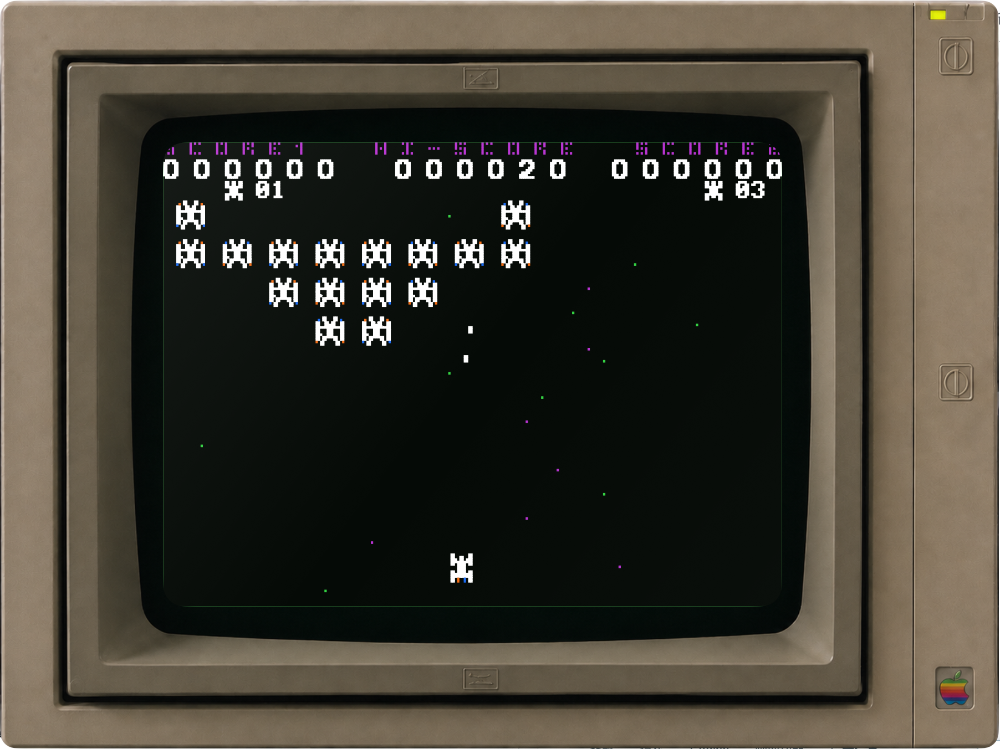

# Apple II Emulator for macOS

一个原生 SwiftUI Apple IIc 模拟器工程，采用硬件总线模型而非“运行 BASIC 的终端”。目前可构建运行，并包含：



- 65C02 核心（包含 IIc 固件所用的 65C02 指令、十进制算术、JMP 间接寻址页尾缺陷）；
- IIc 主/辅助 RAM、80STORE、ALTZP、80 列、双高分辨率和 ROM 银行切换；
- 键盘锁存器、扬声器软开关、40/80 列文字、Lo-Res、Hi-Res、Double Hi-Res 画面；
- 应用内置 Apple IIc ROM 00、03、04、FF，以及仅用于输入排查的诊断 ROM；
- 集成双驱动器 IWM/Disk II，支持 140 KB `.dsk`、`.do`、`.po` 与 35 磁道 `.nib` 映像；
- 顶部“ROM”和“磁盘”菜单：ROM 永远从内置选项选择，磁盘映像才按需由用户选取。
- 不依赖第三方库，可直接用 Xcode 打开 `Package.swift`。

## 运行

```sh
cd AppleIIEmulator
swift run
```

直接打开 `build/AppleIIEmulator.app` 即可运行。首次启动默认使用内置 Apple II+ Autostart ROM，显示经典 `APPLE ][` 开机画面；默认不插入磁盘。通过 GAME 菜单选择游戏会自动装入驱动器 1 并重新启动。测试启动盘仅保留在“磁盘”菜单中，用于验证 ROM、IWM、GCR 解码和 `$0801` 引导链。点一下屏幕即可输入；若要验证键盘回显，可在“ROM”菜单选择“内置诊断 ROM”。

第三方 `.dsk` / `.do`（DOS 顺序）、`.po`（ProDOS 顺序）或 `.nib` 可通过“磁盘”菜单独立装入驱动器 1 或 2；之后按 Command-R 重置即可由该 ROM 启动。“磁盘 → 将驱动器 N 另存为 .nib…”会导出当前（包括写入后的）标准 35 磁道 NIB 映像。请只使用你有权使用的磁盘映像。

项目根目录 `Downloads/AppleIIGames/ftp.apple.asimov.net/images/games/action/` 中的下载游戏会在构建时打包进 App：在窗口的 `GAME` 菜单或菜单栏“游戏”中选择“已下载游戏”，再按首字母选择游戏，即可将其装入驱动器 1，并以 Apple II+ 游戏兼容模式启动。打包后的 App 不依赖原下载目录；“从已下载游戏库打开…”仍保留，供后来新增但尚未打包的映像使用。

## 下一阶段

当前版本以启动和执行为目标；串口、鼠标、逐位 IWM 时序和受保护磁盘格式仍待实现，因此它不是逐周期、全外设覆盖的 Apple IIc 保真模拟器。
