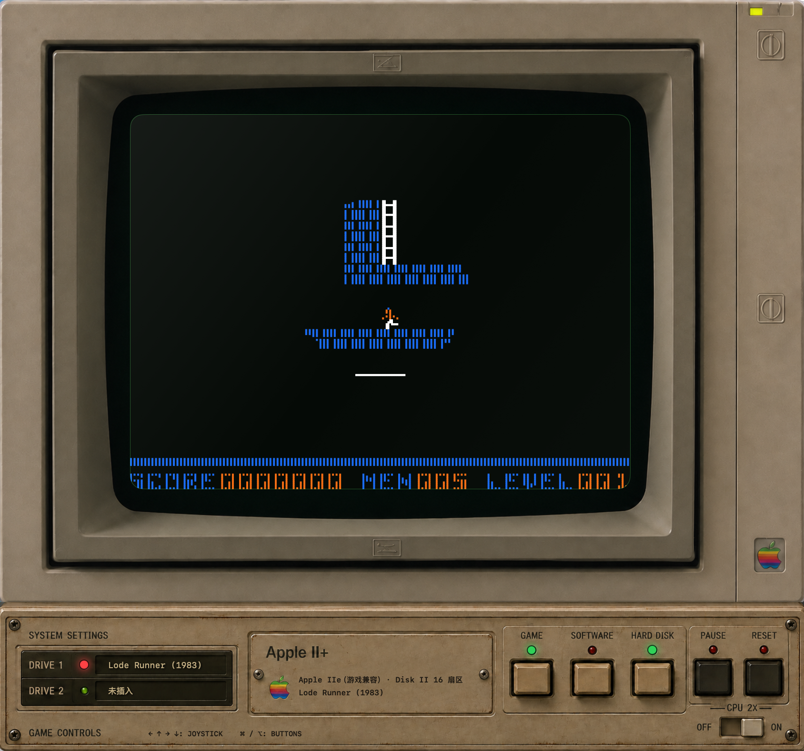

# Apple II Emulator for macOS

一个原生 SwiftUI Apple II 系列模拟器工程，以 Apple IIc 为重点，并覆盖 Apple II+ 与 Apple IIe 的常用启动配置；它采用硬件总线模型，而非“运行 BASIC 的终端”。



## About

Apple II Emulator 是一个为 macOS 打造的原生 Apple II 系列模拟器。它的目标不是把经典软件包装成一个终端，而是以可读、可验证的硬件模型重现 6502、内存映射、视频软开关、Disk II 与一位扬声器的协作方式，并按软件需要选择 Apple II+、IIe 或 IIc ROM。

项目使用 Swift、SwiftUI、AppKit、Foundation 和 AVFoundation 构建，不依赖第三方框架。界面保留了 Apple II 时代的显示器与塑料机箱质感，同时将 ROM、磁盘映像、游戏库和输入控制保持在可直接操作的 macOS 应用中。当前重点是可靠启动和运行经典软件；部分外设与受保护磁盘格式仍在持续完善。

- 65C02 核心（包含 IIc 固件所用的 65C02 指令、十进制算术、JMP 间接寻址页尾缺陷）；
- IIc 主/辅助 RAM、80STORE、ALTZP、80 列、双高分辨率和 ROM 银行切换；
- 键盘锁存器、扬声器软开关、40/80 列文字、Lo-Res、Hi-Res、Double Hi-Res 画面；
- 应用内置 Apple IIc ROM 00、03、04、FF，以及仅用于输入排查的诊断 ROM；
- 集成双驱动器 IWM/Disk II，支持 DOS 顺序 `.dsk/.do`、13 扇区 `.d13`、ProDOS 顺序 `.po`、`.nib` 与 5¼ 英寸 `.2mg/.2img` 映像；`.2mg/.2img` 与 WOZ `INFO` 的写保护标记会传递到 IWM 写保护感测；WOZ 1.x/2.1 保留 quarter-track 映射，支持 BITS 与 FLUX 轨道读取、弱位近似和带 CRC 的 WOZ 2 导出；
- IIc 内置双 6551 ACIA：端口 1（打印机，`$C098-$C09B`）和端口 2（调制解调器，`$C0A8-$C0AB`）具备双级发送缓冲、收发/溢出/帧错/校验错状态与按字长、校验、停止位计算的 CPU 周期时序，并可从“串口”菜单连接到用户选择的 macOS `/dev/cu.*` 设备；设备拔出或主机 I/O 失败时会关闭失效连接，供随后重新连接；
- Apple II+/IIe 的 Mockingboard：slot 4/5 的双 6522 VIA 和双 AY-3-8913（`$C0C0-$C0CF` / `$C0D0-$C0DF`）实现 PSG 寄存器总线、定时器 IRQ 与在模拟线程上按 6502 周期合成的音频；Phasor Native 的 Device Select（`$C0n5`）会将两个 VIA 扩展为四颗 AY-3-8913，以双倍 AY 时钟保持双声道的周期同步混音，并覆盖 AY2 锁存地址镜像至 AY1、双芯片读数据 OR 合并的 GAL 行为；Echo+ 的镜像 `$C4xx` 页映射至第二颗 VIA 及其 AY 对；原生 `$C4xx` 卡页还译码两颗 SSI-263 的五个属性寄存器、A/R 请求线与直连 IRQ（Mockingboard 兼容模式则接至 VIA CA1）；Apple IIc 保留 slot 4 的内置鼠标接口，不会映射此卡；
- IIc 内置鼠标接口：slot 4 的 6821 PIA（`$C0C0-$C0C3`）握手协议、位置/按键、夹紧范围与移动/VBL 中断；显示区域的鼠标移动会馈入该硬件；
- 主板磁带输入/输出（`$C060` / `$C020`）与 Apple II+ 四路 annunciator（`$C058-$C05F`）软开关；
- 内置游戏库按标题首字母分组，并提供 Apple Writer、WordPerfect、VisiCalc、Copy II Plus 与 Apple Pascal 等独立“软件”启动项；
- 菜单栏提供“ROM”“磁盘”“游戏”“软件”和“串口”：可选择内置 ROM、按需打开已验证的用户 ROM 映像，或独立装入磁盘映像。
- “调试”菜单可显示实时 CPU 寄存器、周期和 Disk II 状态；暂停后“单步执行”仍走完整的 CPU 总线周期，不会跳过 I/O 软开关。该菜单也提供会话内的“快速保存状态”（Command-Shift-K）和“快速恢复状态”（Command-Shift-L）：快照包含 CPU、主/辅 RAM、软开关、Disk II、SmartPort、Mockingboard、串口、鼠标和磁带的模拟硬件状态；恢复时会丢弃旧执行批次并按快照中的 ACIA 线路格式重新配置已连接的 macOS 串口。快速状态仅驻留内存，关闭应用后不会保留。
- ROM 菜单可额外打开用户有权使用的 ROM 映像：Apple II/II+ 12 KB，或 Apple IIc 16 KB / 32 KB；加载后会按映像类型切换机器并重置。
- 不依赖第三方库，可直接用 Xcode 打开 `Package.swift`。

## 运行

```sh
cd AppleIIEmulator
swift run
```

若要构建带图标的本地 App，请运行 `make package-app`，然后打开 `build/AppleIIEmulator.app`。首次启动默认使用内置 Apple II+ Autostart ROM，显示经典 `APPLE ][` 开机画面；默认不插入磁盘。通过“游戏”菜单选择游戏会自动装入驱动器 1 并重新启动。测试启动盘仅保留在“磁盘”菜单中，用于验证 ROM、IWM、GCR 解码和 `$0801` 引导链。点一下屏幕即可输入；若要验证键盘回显，可在“ROM”菜单选择“内置诊断 ROM”。

第三方 `.dsk` / `.do`（DOS 顺序）、`.d13`（13 扇区）、`.po`（ProDOS 顺序）、`.nib`、5¼ 英寸 `.2mg/.2img` 或 WOZ 1.x/2.1 位流映像可通过“磁盘”菜单独立装入驱动器 1 或 2；之后按 Command-R 重置即可由该 ROM 启动。SmartPort 硬盘是独立的 slot 7 设备，可从“磁盘”菜单装入 512 字节块的 `.po/.hdv/.img/.2mg/.2img` 映像；在 Apple II+/IIe 上，“从 SmartPort 硬盘启动”会进入 `$C700` 卡 ROM，由该 ROM 将 ProDOS block 0 读入 `$0800` 后执行。WOZ 会遵从其 `INFO` 写保护位；对可写 BITS 映像，IWM 写入保留在当前磁表面中。WOZ 2.1 的 FLUX 间隔以 125 ns tick 读取，并由驱动器上的数字锁相环恢复为控制器位单元；首次写入 FLUX 磁道会将该磁道恢复为 BITS 工作表面，导出时再将修改的位单元重新量化为 FLUX，未修改的 FLUX 磁道仍按原始间隔保留。“磁盘 → 将驱动器 N 另存为 .woz…”会导出带 CRC、保留有效 BITS/FLUX 轨道与 quarter-track 映射的 WOZ 2 文件，且始终要求选择新路径，不会改写原始镜像；未修改磁表面时会保留 `META`、`WRIT` 和兼容的非磁表面扩展块，修改后会丢弃描述旧 BITS 校验的 `WRIT`。`.nib` 导出仍适用于标准 35 磁道 NIB 流。请只使用你有权使用的磁盘映像。

随 App 发布的游戏映像位于 `Sources/AppleIIEmulator/Resources/Games/`，构建时会打包进应用资源。可在窗口的 `GAME` 菜单或菜单栏“游戏”中选择“已下载游戏”，再按首字母选择游戏；它会装入驱动器 1，并以 Apple IIe 游戏兼容模式启动。发布后的 App 只枚举自身资源包，不依赖工作区的 `Downloads` 目录；“从已下载游戏库打开…”仍保留，供选择后来新增但尚未打包的本地映像。“最近玩过”会同时记录内置游戏和用户装入的一到两张启动磁盘，按最近顺序保留 8 项并去重；若磁盘文件后来移动或删除，重新打开该项时会自动移除失效记录。

“软件”菜单将内置生产力软件按其所需的 IIe ROM 与磁盘布局启动。Apple Pascal 1.3 会将启动盘和工具盘分别装入两个驱动器；WordPerfect 1.1 使用独立的持久化工作盘，避免覆盖随 App 发布的原始映像。

## 下一阶段

当前版本以启动和执行为目标。Apple IIc 的两个 6551 ACIA 可从“串口”菜单连接到用户选择的 macOS `/dev/cu.*` 设备；主机 I/O 在独立队列上运行，收发字节仍经 ACIA 寄存器和 6502 周期时序进入模拟器，字长、奇偶校验、停止位和波特率也会同步到 macOS termios，并以 macOS PTY 端到端回归覆盖主机收发、设备 EOF/错误断开与重连安全。标准 macOS termios 未提供 3600-baud 档，选择该 ACIA 档位时会明确报错，不会以错误速率通信。Mockingboard 目前覆盖双 VIA/双 PSG 的常用音乐路径、Timer 1/2 IRQ 与 CPU/T2 时钟的 VIA 移位寄存器；Phasor 已覆盖四 AY 的 Native Device Select 和混音，以及 SSI-263 的属性寄存器、周期驱动 A/R/IRQ 握手，完整的音素波形与声道滤波仍在开发中。清理过的 WOZ 弱区按 MC3470 的四位延迟窗口处理，并在连续零单元后生成确定性的假脉冲；FLUX 使用以磁道为单位的数字锁相恢复，写入后会重新量化为 125 ns tick FLUX 间隔。仍未覆盖逐元件模拟的模拟读放大器，以及接入真实外置串口硬件的人工兼容性验证。因此它不是逐周期、全外设覆盖的 Apple IIc 保真模拟器。
